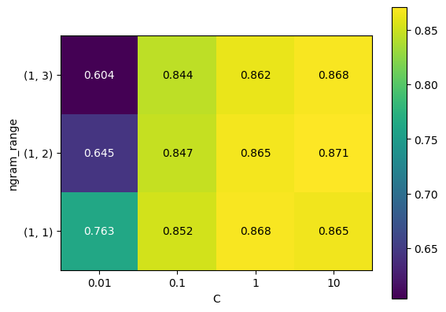

# sentiment_analysis

Using sklearn's TF-IDF Vectorizer and LogisticRegression, this project aims to analyze the specific words that contribute to positive and negative classifications of phrases.

Dataset: https://www.kaggle.com/datasets/abhi8923shriv/sentiment-analysis-dataset?resource=download

This project apporaches the problem as binary classification, positive or negative. The data is processed and is then filterd for stop words, made lowercase, and every word is stemmed. A GridSearchCV and Pipeline were used to put the TF-IDF Vectorizer and LogisticRegression models together. These are the accuracy results from the Grid Search:

Here are the most important coefficients to the LogisticRegression model. The words on the far left have a heavy negative correlation, while the words on the far right have a heavy positive correlation:

